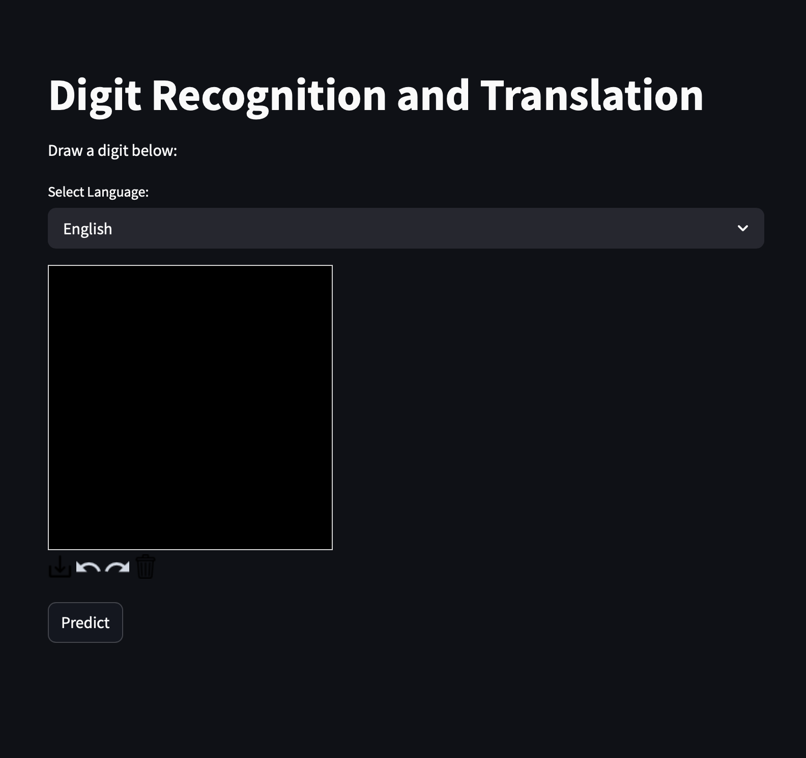

# 🖌️ Digit Recognition and Translation

Этот проект представляет собой сверточную нейронную сеть (CNN), обученную распознавать рукописные цифры из набора данных MNIST с использованием Keras. Итоговая точность 0,988.

### 📦 Стек технологий

- Streamlit — для создания веб-интерфейса
- Keras — для загрузки обученной модели нейросети
- OpenCV — для обработки изображений
- gTTS — для озвучки результата
- pyngrok — для создания публичной ссылки на приложение

### 🚀 Как запустить проект

1. Клонируйте репозиторий или скопируйте код.
2. Установите необходимые библиотеки
```bash
pip install -r requirements.txt
```
3. Измените путь до модели
```bash
/Users/denstep256/Documents/project/Python/AI/MNIST-AI/models/Model.keras
```
4. Скачать NGROK:
https://ngrok.com/download
5. Авторизоваться:
```bash
ngrok config add-authtoken ВАШ_NGROK_ТОКЕН
```
6. Запустите приложение

```bash
streamlit run app.py
```
### 📷 Интерфейс

